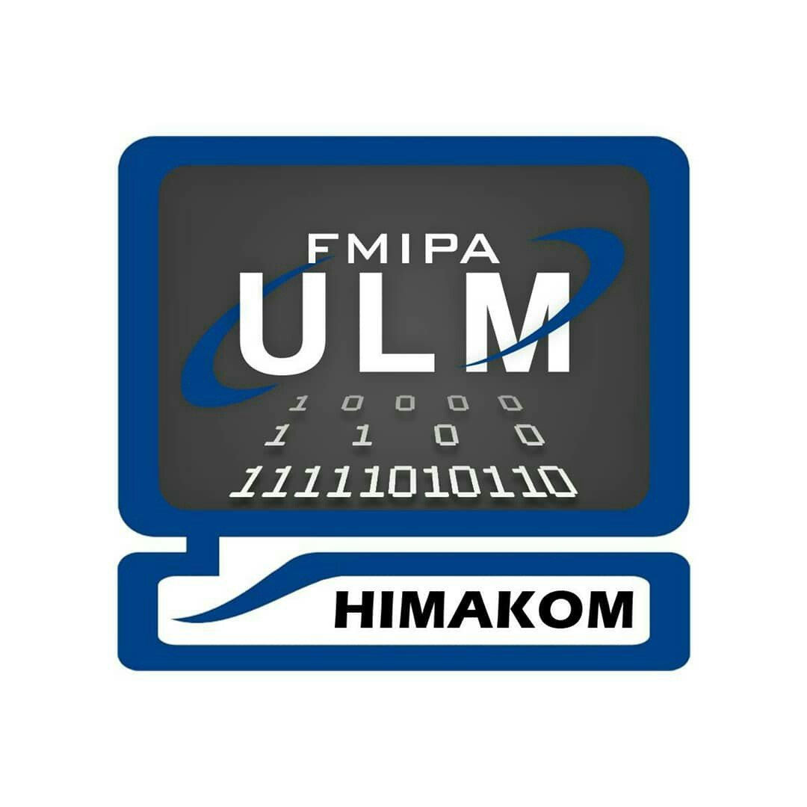
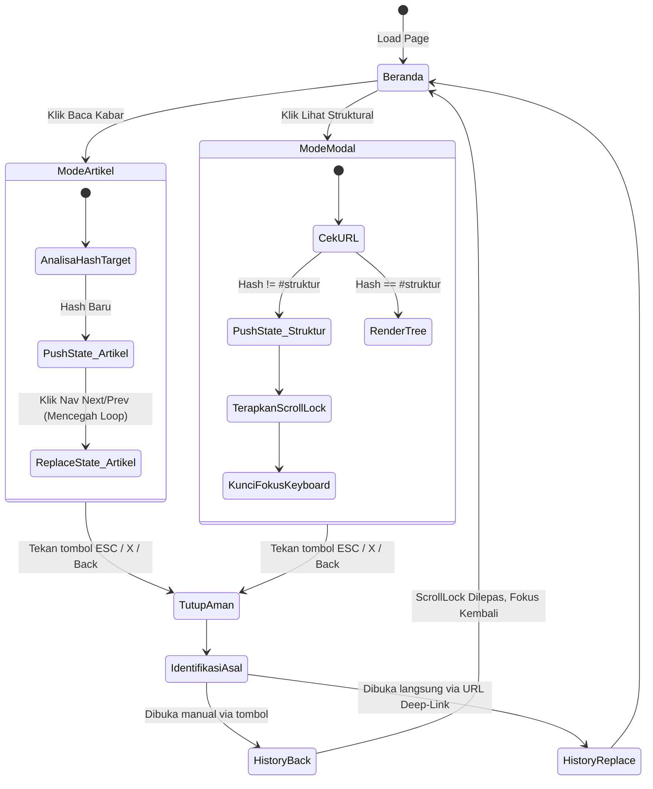

<div align="center">
  
  
  # 🏛️ Kabinet Rahman 25 Public Portal
  
  **Platform Organisasi Himpunan Mahasiswa Ilmu Komputer — FMIPA Universitas Lambung Mangkurat.**<br>
  *Satu Himpunan. Lebih Bersinergi.*

  <br>

  [](#-status-pengembangan)
  [](#-test-coverage--resiliency)
  [](#-aksesibilitas--ketahanan-a11y)
  [](#-uiux--arsitektur-desain)
  [](#-quick-start)

  <br>
</div>

> [!WARNING]
> **PEMBERITAHUAN PRATINJAU (PREVIEW NOTICE)**
> Repositori ini berisi prototipe antarmuka publik. **Seluruh data (nama pengurus, proker, berita, foto, agenda, arsip, statistik) merupakan KONTEN CONTOH (Dummy/Provisional)** dan belum disahkan. Form aspirasi merupakan **simulasi lokal tanpa backend**, pesan tidak dikirim ke mana pun.

---

## 📑 Daftar Isi Interaktif
- [🌟 Sorotan Fitur Utama](#-sorotan-fitur-utama)
- [🧩 Deep Dive Fitur & Interaksi (Logika)](#-deep-dive-fitur--interaksi-logika)
- [📐 UI/UX & Arsitektur Desain](#-uiux--arsitektur-desain)
- [♿ Aksesibilitas & Ketahanan (A11y)](#-aksesibilitas--ketahanan-a11y)
- [🧪 Test Coverage & Resiliency](#-test-coverage--resiliency)
- [⚙️ Diagram Sistem & Alur Logika](#-diagram-sistem--alur-logika)
- [🚀 Quick Start (Local Setup)](#-quick-start-local-setup)

---

## 🌟 Sorotan Fitur Utama

| Fitur | Status Modul | Kemampuan Logika Khusus |
|---|---|---|
| **Pohon Organisasi** | ✅ Stabil | Filter Departemen, Dinamis Roster, Panel Eksplorasi Modal (44 anggota) |
| **Katalog Proker** | ✅ Stabil | Real-time Live Search, Filter Kategori Departemen, Penanganan Status Kosong (Empty State) |
| **Garis Waktu Agenda** | ✅ Stabil | Sinkronisasi Waktu Jakarta (WIB), *Rollover* Otomatis Tengah Malam, Pil Filter Berbasis Data |
| **Pembaca Kabar** | ✅ Stabil | Modal Multi-lapis, Kunci Gulir Otomatis (ScrollLock), Tautan Dalam (*Deep-linking URL Hash*) |
| **Galeri Dokumentasi** | ✅ Stabil | Sistem _Fallback_ Gambar Gagal (Outage Proof), Navigasi Keyboard Penuh (`Arrow`, `Esc`) |
| **Simulasi Aspirasi** | ✅ Stabil | Validasi Sisi-Klien (Client-side), Penghitung Karakter Waktu Nyata, Tukar Status Sukses Permanen |

<br>

<details>
<summary><b>🖼️ Klik untuk melihat cuplikan antarmuka di berbagai perangkat (Screenshots)</b></summary>

| Desktop View (1440px) | Split-Screen / Tablet Landscape (1024px) |
| :---: | :---: |
|  |  |
| *Fluid Layout & Sidebar Adaptif* | *Resilient Navbar (No Collision)* |

| Tablet Portrait (768px) | Mobile UI (390px) |
| :---: | :---: |
|  |  |
| *Drawer Nav & Single Column Grid* | *Full Touch Ergonomics* |

</details>

---

## 🧩 Deep Dive Fitur & Interaksi (Logika)

Sistem dibangun tanpa pustaka eksternal (No React, No Vue, No jQuery). Sepenuhnya **Vanilla JavaScript** dengan pengelolaan memori dan status (state machine) yang ketat. 

*(Klik pada setiap modul di bawah untuk mempelajari logika mendalam dan pintasan keyboard).*

<details>
<summary><b>1. Modal Penjelajah Fungsionaris (Organization Explorer)</b></summary>
<br>

Menaungi hierarki 44 anggota (DPO, BPH, dan 7 Departemen). Tidak menggunakan navigasi halaman, melainkan *Single-Page Modal* berlapis.

- **Alur Interaksi:**
  - Klik "Lihat Struktural" -> Kunci *Scroll* layar belakang -> Modal Muncul -> URL berubah menjadi `#struktur`.
  - Sistem filter merender elemen via CSS `display` manipulation tanpa membongkar DOM, menjaga performa tetap 60fps.
  - Saat ditutup (Klik X atau luar area), state `popstate` memicu `history.back()` agar tumpukan penelusuran (*browser history stack*) tidak kotor. Jika dibuka kembali, filter akan mereset diri secara otomatis ke status "Semua".
- **Aksesibilitas Keyboard:**
  - <kbd>Tab</kbd> / <kbd>Shift</kbd> + <kbd>Tab</kbd> : Terperangkap (*Focus Trap*) hanya di dalam modal aktif. Elemen di latar belakang tidak bisa difokuskan.
  - <kbd>Esc</kbd> : Menutup modal dan melepas *ScrollLock*.

</details>

<details>
<summary><b>2. Timeline Agenda dengan Mesin Waktu Jakarta</b></summary>
<br>

Merender jadwal 18 kegiatan dari bulan April - Desember. 

- **Penjadwalan Dinamis (Jakarta Timezone Engine):** 
  - Status acara (✅ Selesai / ▶ Berjalan / ◯ Akan Datang) dihitung menggunakan komparator rentetan tanggal ISO (`sv-SE` locale) yang dipaksa ke `Asia/Jakarta`.
  - Terdapat pendengar (*listener*) `visibilitychange` dan **timer tengah malam (*midnight rollover timer*)**. Jika pengguna membiarkan tab terbuka dan waktu berganti hari, lencana status akan berubah secara langsung (Live) tanpa perlu *refresh*.
- **Tombol Scroll Otomatis:** Tombol "↓ Terdekat" akan mensortir elemen dan meluncur mulus (smooth scroll) persis ke kartu acara terdekat yang belum berlalu, menyorotnya dengan kilauan efek sesaat.

</details>

<details>
<summary><b>3. Pembaca Artikel (News Modal) & Tautan Dalam (Deep-linking)</b></summary>
<br>

Sistem pembaca artikel *built-in* dengan proteksi status riwayat browser.

- **Integrasi History API Lanjut:** Membuka artikel mengubah URL (contoh: `#kabar-pelatihan`).
- **Navigasi Next / Prev:** Mengklik tombol Selanjutnya/Sebelumnya memicu `history.replaceState()`. Artinya, pengunjung bisa melompat 10 berita, dan ketika menekan tombol kembali (*Back*) di HP, mereka akan langsung keluar dari modal (bukan mundur satu per satu berita).
- **Fallback Salin Tautan (Clipboard API):**
  - Menggunakan fungsi modern `navigator.clipboard.writeText`.
  - Jika berada di peramban lama atau server Non-HTTPS (dimana Clipboard diblokir), skrip banting stir ke elemen input temporal lalu memanggil fungsi warisan `document.execCommand('copy')`.
  - Muncul lencana status hidup "✓ Tersalin!" atau "Gagal menyalin" (*aria-live*).

</details>

<details>
<summary><b>4. Galeri Lightbox Tangguh (Outage-Proof)</b></summary>
<br>

- **Pergantian Resolusi Instan:** Lightbox mengambil gambar dari atribut `currentSrc` (resolusi responsif terbaik yang diunduh peramban), lalu berpindah otomatis, bukan hanya mengambil dari atribut `src` statis.
- **Kesalahan Jaringan (Error Fallback):** Jika API gambar eksternal lumpuh atau mati koneksi, _event listener_ `onerror` mencegat galat dan menukar gambar yang hancur menjadi avatar *placeholder* cadangan beserta penanda teks "Gambar pratinjau cadangan".
- **Kendali Keyboard:**
  - <kbd>→</kbd> (Panah Kanan) : Gambar berikutnya.
  - <kbd>←</kbd> (Panah Kiri) : Gambar sebelumnya.
  - Loop putar tak terbatas (gambar akhir lanjut ke gambar pertama).

</details>

<details>
<summary><b>5. Formulir Simulasi Ruang Aspirasi</b></summary>
<br>

- **Pencegah Manipulasi Timer (Memory Leak Guard):**
  - Formulir tertahan selama 600 milidetik saat mengklik tombol *Kirim*.
  - Jika pengguna mengeklik tombol beberapa kali secara instan, pencegah *Double-Submit* menolak klik lanjutan, memastikan label tombol tidak rusak.
  - Jika tab ditutup atau disembunyikan saat hitung mundur, skrip membersihkan jejak (*garbage collected via `pagehide` & `clearTimeout`*).
- **Siklus UX:**
  - Validasi error dikaitkan melalui ID secara semantik menggunakan `aria-describedby` (Screen Reader akan membacakan pesannya).
  - Penghitung karakter (0 / 500) menyala secara proaktif.
  - Penggantian DOM permanen antara Form ↔ Kartu Status Sukses.

</details>

---

## ⚙️ Diagram Sistem & Alur Logika

Berikut adalah peta arsitektur status mesin (*State Machine*) yang melandasi keutuhan pengalaman web saat menangani Modal Bertingkat & Browser History (Mencegah pengunjung terjebak/terperangkap).



---

## ♿ Aksesibilitas & Ketahanan (A11y)

| Standar WCAG 2.2 AA | Pemenuhan Khusus (Custom Implementation) |
|---|---|
| **Visibilitas Fokus** | `outline: 3px solid var(--clay-blue)` pada setiap link & field. Tombol kapsul ditimpa `border-radius: 999px` spesifik agar outline tidak memotong ujungnya (*Visual Clipping Guard*). |
| **Navigasi Keyboard** | *Focus Trap* berhitung matriks untuk membedakan tab "Semua", "DPO" dst agar tidak membocorkan rentang fokus ke departemen yang `display:none`. Filter menggunakan atribut tombol murni `aria-pressed`, bukan `tablist` ARIA yang sering rusak di peramban seluler. |
| **Motion Constraint** | `@media (prefers-reduced-motion: reduce)` diterapkan absolut. Animasi CSS dipadamkan menjadi state final (opacity: 1) seketika. Penghitung angka stastik statis seketika tanpa transisi, pahlawan grafis (*hero glow*) tak lagi bernapas melayang. |
| **Screen Readers** | Teks keterangan error (*Field Error*) dihubungkan dengan `.id` akurat memakai mekanisme `aria-describedby`. Status interaksi memuat status di belakang layar (*off-screen live status*) memanggil `aria-live="polite"`. |
| **Kinerja GPU (Performa)** | Animasi gelembung hero atmosfer otomatis dilumpuhkan (*Play State Paused*) oleh pengamat irisan (*IntersectionObserver*) segera setelah pahlawan hilang dari pandangan gulir layar. |

---

## 📐 UI/UX & Arsitektur Desain

Desain dirancang dengan patokan ekspektasi UI Aplikasi Premium Agensi, mengacu pada struktur pedoman antarmuka `DESIGN.md`. 

> **Aset Filosofi Desain:** Institusional bersih. Menghindari "AI Slop Default" (tanpa efek neon lebay, tanpa latar blur glassmorphism generik penuh layar). 
> **Pendekatan:** White Canvas (`#FFFFFF`), Navy Ink (`#15243A`), dan aksen Muted Teal (`#087C78`).

* **Sistem Navigasi Ganda Tahan Banting:** Jika resolusi ditekan ke ukuran kritis antara laptop dengan layar terbelah (`1024px` hingga `1279px`), navigasi langsung *mengalah* dan runtuh rapi ke laci hamburger seluler, sehingga logo dan tautan tidak pernah saling bertabrakan atau tumpang tindih se-piksel pun! (`flex-shrink: 0`, `overflow: hidden`).
* **Elevasi Terkendali (Subtle Lift):** Efek angkat (*hover*) pada kartu dikalibrasi ketat ke tarikan vertikal `-2px` yang profesional. Layar sentuh mobile mendeteksi `@media (hover: none)` dan mematikan efek angkat untuk menghilangkan distorsi ketukan kaku (*tap stuck-hover*).
* **Format Penomoran Lokal:** Seluruh label metrik besar dikuratori murni menggunakan pelokalan ganda `Intl.NumberFormat('id-ID')` sehingga angka berdarah (misal: 1500) dirender sebagai standar regional (1.500+).

---

## 🧪 Test Coverage & Resiliency

Stabilitas logika proyek disangga menggunakan **31 Pengujian Otomatis (*E2E Playwright*)**. Cakupan pengujian menginvestigasi area musuh (*adversarial scenarios*):

<details>
<summary><b>✅ Lihat Daftar 31 Tes Regresi & Integrasi Berhasil</b></summary>

- `[x]` **Responsivitas & Render:** Desktop (1440px), Split-Screen (1024px), Tablet (768px), Mobile (390px), Sempit (320px) — Tidak ada asset rusak atau overflow horisontal yang meledak.
- `[x]` **Celah Tumpang Tindih:** Elemen Navbar terjamin tidak pernah beririsan/tabrakan melintasi semua dimensi batas pertengahan (*intermediate viewports*).
- `[x]` **Operasi Fokus Ponsel:** Navigasi burger mendukung papan ketik, seleksi rute mulus, tombol penutup (*Escape*), serta merestorasi penelusuran lokasi klik terakhir.
- `[x]` **Penjelajahan Skala & Grid:** 21 kartu render program tersaring utuh dan dinamis. Angka statistik dirender sebagai nomor sungguhan, tak terjebak permanen di titik nol.
- `[x]` **Perangkat Lintas & History:** Penekanan berulang tombol *Prev/Next* artikel mengganti status mesin (*replace state*) tanpa menumpuk tumpukan *history*. 
- `[x]` **Pemblokiran Overlays (Modal/Lightbox):** Tombol *Escape* sukses membabat habis hamparan aktif di atas segalanya, dan celah rembesan gulir mouse sama sekali hilang (`depth: 0`). Tab-trap berhasil mengekang siklus `Tab`.
- `[x]` **Kesalahan Server Simulasi & Jaringan:** Skrip jatuh-bebas gambar galeri yang gagal ditangkap jaringan (*network outage*) dibanting berhasil ke _fallback placeholder source_. 
- `[x]` **Zona Waktu Valid:** *Badge* garis waktu (Berjalan/Akan Datang) terbukti mendeteksi batas zona Jakarta (`Asia/Jakarta`) mematahkan siklus zona waktu *runner engine* bawaan test.

</details>

---

## 🚀 Quick Start (Local Setup)

Repositori ini bergantung pada struktur statis (`Vanilla JS / HTML / CSS`), sehingga tidak memerlukan kerangka *React* atau proses pembangunan kompilasi Webpack yang pelik.

**1. Salin Proyek / Git Clone:**
```bash
git clone https://github.com/RahmannCH/Kabinet_Rahman25.git
cd Kabinet_Rahman25
```

**2. Jalankan Server Pengembangan (Tanpa Instalasi Dependensi):**
Server lokal primitif sudah disediakan di proyek ini mengandalkan `Node.js` polos:
```bash
node scripts/serve.mjs
# Atau menggunakan perintah NPM
npm run dev
```
> Kunjungi: `http://127.0.0.1:49173`

**3. Bangun Rilis & Evaluasi Produksi (Dist):**
Untuk menyingkirkan elemen sampah pengujian dan menghasilkan struktur rilis untuk penyedia hosting statik (*Vercel/Netlify/GitHub Pages*):
```bash
npm run build
npm run preview
```

**4. Jalankan Sistem Tes E2E (Dibutuhkan Playwright):**
Jika Anda menyumbang kode, pastikan ke 31 pengujian integritas lolos sebelum melakukan *Pull Request*:
```bash
npm install
npm run test
```

---

<div align="center">
  <br>
  <b>Dikembangkan secara iteratif dengan standar Kinerja Aplikasi Web, Toleransi Bencana (Resiliency), dan Aksesibilitas Modern.</b><br>
  © 2027 HIMAKOM FMIPA ULM — Kabinet Rahman 25
</div>